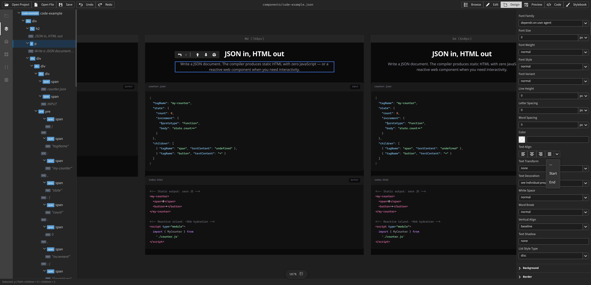

<p align="center">
  
</p>

<p align="center">
  Build reactive web applications with plain JSON.<br>
  A declarative component model, reactive runtime, visual builder, and static compiler — all from <code>.json</code> files.
</p>

<p align="center">
  <a href="https://jxsuite.com">Website</a> &middot;
  <a href="https://jxsuite.com/docs/getting-started">Docs</a> &middot;
  <a href="https://jxsuite.com/docs/spec">Spec</a>
</p>

---

## What is Jx?

Jx is a schema and runtime for building reactive web applications using **plain JSON**. A Jx application is a tree of JSON objects whose structure mirrors the DOM API, whose reactivity is powered by [`@vue/reactivity`](https://github.com/vuejs/core/tree/main/packages/reactivity), and whose behavior is declared as inline functions or external module references.

```json
{
  "$id": "Counter",
  "state": {
    "count": 0,
    "increment": { "$prototype": "Function", "body": "state.count++" }
  },
  "tagName": "my-counter",
  "children": [
    { "tagName": "span", "textContent": "${state.count}" },
    { "tagName": "button", "textContent": "+", "onclick": { "$ref": "#/state/increment" } }
  ]
}
```


### Key ideas

- **DOM-first** — Property names mirror the DOM API (`tagName`, `className`, `textContent`, `onclick`). Nothing new to learn.
- **Reactive everywhere** — Template strings `"${state.count} items"` work anywhere a string value appears. Dependencies are tracked automatically.
- **JSON Schema dialect** — Documents are valid JSON Schema 2020-12. `$ref`, `$defs`, and `$id` work as expected. Schema tooling (validation, autocomplete, LSP) applies directly.
- **Rule of Least Power** — Declarative JSON over imperative JS. `$ref` bindings over template expressions. Template expressions over handler functions. Functions only when logic demands it.
- **Component encapsulation** — Signal scope is bounded at the custom element level. Cross-component data flows through explicit `$props`.

## Packages

| Package | Description |
|---------|-------------|
| [`@jxsuite/runtime`](packages/runtime) | JSON-native reactive web component runtime |
| [`@jxsuite/compiler`](packages/compiler) | Static HTML compiler, island detector, and site builder |
| [`@jxsuite/server`](packages/server) | Dev server with live reload, server-side proxy, and studio integration |
| [`@jxsuite/studio`](packages/studio) | Visual builder for Jx documents |
| [`@jxsuite/desktop`](packages/desktop) | Standalone desktop app (Electrobun) |
| [`@jxsuite/schema`](packages/schema) | JSON Schema 2020-12 meta-schema generator |
| [`@jxsuite/parser`](packages/parser) | Markdown parser and external class integration |

## Quick start

```bash
# Clone and install
git clone https://github.com/jxsuite/jx.git
cd jx
bun install

# Start the dev server with examples
bun run dev

# Run tests
bun test

# Build all packages
bun run build
```

The dev server starts at `http://localhost:3000` with interactive examples (counter, todo list, forms, fetch, routing, and more).

## How it works

### State is data

Every component declares its state in a `state` object. The shape of each entry determines its type — no flags needed:

```json
{
  "state": {
    "count": 0,
    "name": "World",
    "greeting": "${state.name}, you clicked ${state.count} times",
    "increment": { "$prototype": "Function", "body": "state.count++" },
    "userData": { "$prototype": "Request", "url": "/api/user", "method": "GET" }
  }
}
```

| Shape | Detected by | Becomes |
|-------|-------------|---------|
| Naked value | Scalar, array, or plain object | `reactive()` property |
| Computed | String containing `${}` | `computed()` |
| Function | `$prototype: "Function"` | Event handler or computed |
| Data source | `$prototype: "Request"`, etc. | Reactive async value |

### Reactive bindings

Template strings work anywhere — element properties, styles, attributes:

```json
{
  "tagName": "div",
  "className": "${state.active ? 'card active' : 'card'}",
  "style": { "opacity": "${state.loading ? '0.5' : '1'}" },
  "attributes": { "aria-label": "${state.count} unread" }
}
```

### Dynamic lists

```json
{
  "tagName": "ul",
  "children": {
    "$prototype": "Array",
    "items": { "$ref": "#/state/todos" },
    "map": {
      "tagName": "li",
      "textContent": "${$map.item.text}"
    }
  }
}
```

### Component composition

Components reference each other via `$ref` and pass data through `$props`:

```json
{
  "children": [
    {
      "$ref": "./components/card.json",
      "$props": {
        "title": "Hello",
        "count": { "$ref": "#/state/count" }
      }
    }
  ]
}
```

### Built-in web API prototypes

| `$prototype` | Web API | Description |
|-------------|---------|-------------|
| `Request` | Fetch | Reactive HTTP requests with debounce and abort |
| `LocalStorage` | Storage | Persistent reactive key-value storage |
| `SessionStorage` | Storage | Session-scoped reactive storage |
| `Cookie` | Cookie | Cookie management with options |
| `IndexedDB` | IDB | Store creation, indexes, CRUD |
| `FormData` | FormData | Form field population |
| `Set` / `Map` | — | Reactive collections |

### Server functions

Mark a state entry with `timing: "server"` to run it server-side. The browser receives only the return value — secrets stay on the server:

```json
{
  "state": {
    "metrics": {
      "$src": "./dashboard.server.js",
      "$export": "fetchMetrics",
      "timing": "server"
    }
  }
}
```

## Studio

Jx Studio is a visual builder for Jx documents, available as a browser-based dev tool and a standalone desktop app.

<p align="center">
  
</p>

- Canvas with live preview and inline editing
- Layer tree, inspector, and state editor
- Component library with drag-and-drop
- Runs in Chrome (dev mode), Electrobun (desktop), or cloud (future)

## Development

```bash
bun run dev          # Dev server with examples
bun test             # Run test suite
bun run build        # Build all packages
bun run lint         # Lint with oxlint
bun run format       # Format with oxfmt
bun run typecheck    # TypeScript checking
bun run desktop      # Launch desktop app (Electrobun)
```

## License

MIT
